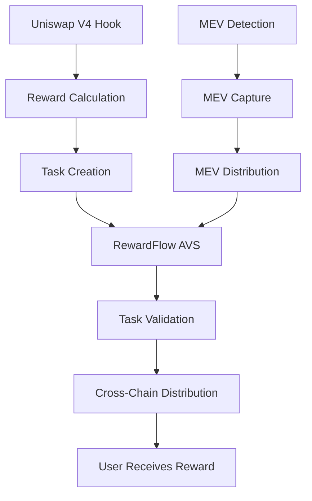

# RewardFlow AVS

## Overview

RewardFlow AVS is an Actively Validated Service (AVS) built on the EigenLayer network that processes reward distribution tasks from Uniswap V4 hooks across multiple chains. It provides a decentralized, secure, and efficient way to distribute rewards to liquidity providers and traders based on their activity and engagement.

## What is RewardFlow?

RewardFlow is a comprehensive reward distribution system that:

- **Integrates with Uniswap V4 Hooks**: Captures liquidity provision and trading activity
- **Cross-Chain Distribution**: Distributes rewards across multiple blockchain networks
- **MEV Protection**: Detects and captures MEV for fair distribution to users
- **Engagement-Based Rewards**: Calculates rewards based on user activity, loyalty, and engagement
- **Decentralized Validation**: Uses EigenLayer AVS for secure, decentralized task processing

## Architecture

### Core Components

1. **Uniswap V4 Hooks** (`src/hooks/`)
   - `RewardFlowHook.sol`: Main hook for liquidity provision and swap rewards
   - `RewardFlowHookMEV.sol`: MEV detection and capture hook

2. **Cross-Chain Distribution** (`src/distribution/`)
   - `RewardDistributor.sol`: Handles cross-chain reward distribution via Across Protocol

3. **Position Tracking** (`src/tracking/`)
   - `CrossChainPositionTracker.sol`: Tracks LP positions across multiple chains

4. **AVS Components** (This Repository)

   - `RewardFlowTaskHook.sol`: Validates and processes reward distribution tasks
   - `RewardFlowAVSRegistrar.sol`: Manages operator registration and configuration
   - Go Performer: Processes reward distribution tasks off-chain

### Task Flow



## Getting Started

### Prerequisites

- Go 1.23.6+
- Foundry
- Docker
- EigenLayer devkit

### Installation

```bash
# Clone the repository
git clone https://github.com/RewardFlow/RewardFlowAVS.git
cd RewardFlowAVS

# Install dependencies
go mod tidy

# Build contracts
make build-contracts

# Build Go binary
make build
```

### Running the AVS

#### Development Mode

```bash
# Start the devnet (deploys contracts and starts Hourglass infrastructure)
devkit avs devnet start --skip-avs-run

# Run the RewardFlow AVS Performer
devkit avs run
```

#### Production Mode

```bash
# Build and run
make build
./bin/rewardflow-avs
```

## Smart Contracts

### RewardFlowTaskHook.sol

The main task hook contract that:

- Validates reward distribution tasks
- Processes cross-chain reward distributions
- Manages task fees and statistics
- Tracks processed tasks to prevent double-spending

**Key Functions:**
- `validatePreTaskCreation()`: Validates task parameters
- `handlePostTaskCreation()`: Tracks task creation
- `validatePreTaskResultSubmission()`: Validates result submission
- `handlePostTaskResultSubmission()`: Processes task results
- `calculateTaskFee()`: Calculates task processing fees

### RewardFlowAVSRegistrar.sol

The AVS registrar contract that:

- Manages operator registration for the RewardFlow AVS
- Handles stake requirements and limits
- Manages RewardFlow-specific configuration
- Tracks operator statistics

**Key Functions:**
- `registerRewardFlowOperator()`: Registers new operators
- `deregisterRewardFlowOperator()`: Deregisters operators
- `updateRewardFlowConfig()`: Updates AVS configuration
- `getRewardFlowStats()`: Returns AVS statistics

## Go Performer

The Go performer (`cmd/main.go`) implements the core business logic:

### TaskWorker

The `RewardFlowTaskWorker` struct handles:

- **Task Validation**: Validates reward distribution parameters
- **Reward Processing**: Calculates fees and distributes rewards
- **Cross-Chain Logic**: Determines target chains for distribution
- **Statistics Tracking**: Maintains processing statistics

### Task Types

The performer processes `RewardDistributionTask` objects with:

```go
type RewardDistributionTask struct {
    User           string   `json:"user"`
    Amount         *big.Int `json:"amount"`
    ChainID        uint64   `json:"chain_id"`
    PoolID         string   `json:"pool_id"`
    RewardType     string   `json:"reward_type"` // "liquidity", "swap", "mev"
    Timestamp      int64    `json:"timestamp"`
    HookAddress    string   `json:"hook_address"`
    TransactionHash string  `json:"transaction_hash"`
}
```

## Configuration

### Environment Variables

```bash
# AVS Configuration
AVS_PORT=8080
AVS_TIMEOUT=30s
AVS_LOG_LEVEL=info

# Reward Configuration
MIN_REWARD_AMOUNT=1000000000000000  # 0.001 ETH
MAX_REWARD_AMOUNT=100000000000000000000  # 100 ETH
TASK_FEE=100000000000000  # 0.0001 ETH

# Chain Configuration
SUPPORTED_CHAINS=1,10,42161,137,8453  # Ethereum, Optimism, Arbitrum, Polygon, Base
```

### RewardFlow Configuration

The AVS supports dynamic configuration through the registrar:

- `min_reward_amount`: Minimum reward amount
- `max_reward_amount`: Maximum reward amount
- `task_fee`: Task processing fee
- `supported_chains`: List of supported chain IDs

## Testing

### Unit Tests

```bash
# Test contracts
make test-contracts

# Test Go code
make test-go
```

### Integration Tests

```bash
# Run integration tests
make test-integration
```

### Performance Tests

```bash
# Run performance benchmarks
make benchmark
```

## Deployment

### Contract Deployment

```bash
# Deploy to testnet
make deploy-testnet

# Deploy to mainnet
make deploy-mainnet
```

### AVS Deployment

```bash
# Register AVS with EigenLayer
devkit avs register

# Deploy AVS contracts
devkit avs deploy

# Configure AVS
devkit avs configure
```

## Monitoring

### Metrics

The AVS provides comprehensive metrics:

- Total tasks processed
- Total rewards distributed
- Total MEV captured
- Average processing time
- Success rate
- Operator statistics

### Logging

Structured logging with JSON format:

```json
{
  "timestamp": "2024-01-01T00:00:00Z",
  "level": "info",
  "message": "Processing RewardFlow task",
  "task_id": "0x123...",
  "user": "0xabc...",
  "amount": "1000000000000000000",
  "reward_type": "liquidity"
}
```

## Security

### Validation

- Task parameter validation
- Amount threshold checks
- Timestamp validation
- Chain ID verification
- Duplicate task prevention

### Access Control

- Owner-only configuration updates
- Operator registration controls
- Fee management restrictions

## Contributing

1. Fork the repository
2. Create a feature branch
3. Make your changes
4. Add tests
5. Submit a pull request

## License

This project is licensed under the BUSL-1.1 License - see the [LICENSE](LICENSE) file for details.

## Support

- Documentation: [docs.rewardflow.io](https://docs.rewardflow.io)
- Discord: [discord.gg/rewardflow](https://discord.gg/rewardflow)
- GitHub Issues: [github.com/RewardFlow/RewardFlowAVS/issues](https://github.com/RewardFlow/RewardFlowAVS/issues)

## ⚠️ Warning: This is Alpha, non-audited code ⚠️

RewardFlow AVS is in active development and is not yet audited. Use at your own risk.